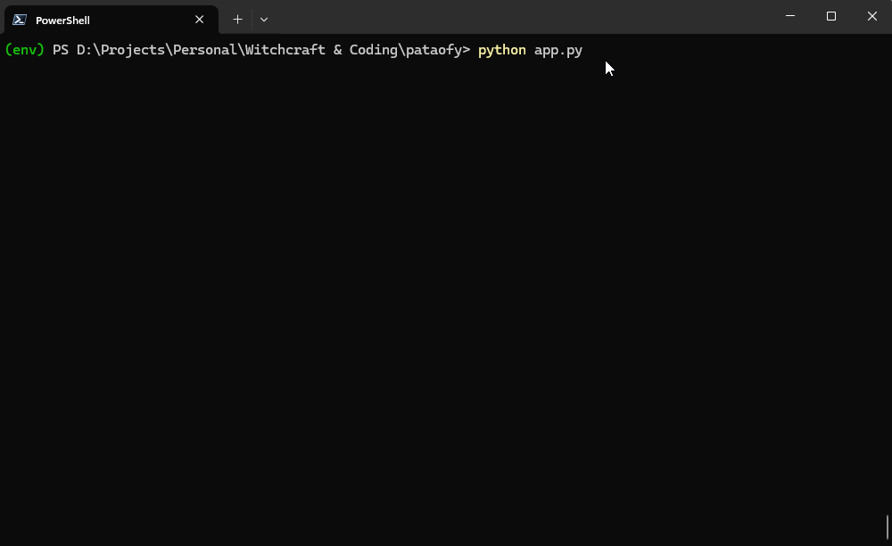

# Pataofy
Use this app to patao your favourite person (or not, not very unlike a bad-advising well-intentioned friend)!



## Instructions
1. Get your API Key from [Google AI Studio](https://ai.google.dev/aistudio) and store in the environment variable `API_KEY`. Our app also supports `.env`!
2. Install the dependencies from `requirements.txt`. 
```shell
pip install -r requirements.txt
```
3. Execute the app.
```shell
python app.py
```
4. Have fun with it!

# Made with 💙 by Param and vengeance by Medha.